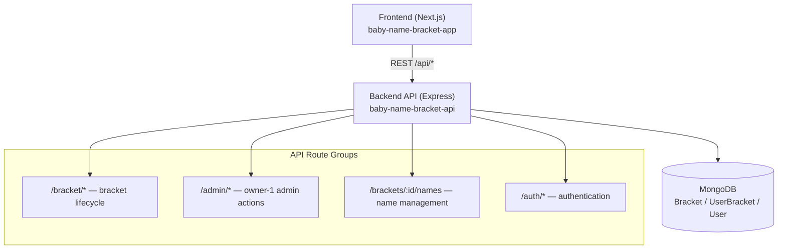

# App-Wide System Diagram

This diagram shows the top-level service boundaries and cross-service call groups registered in the app.

## Registered admin endpoints (no auth middleware at router level)

| Method | Path | Controller |
|--------|------|------------|
| POST | `/api/admin/set-winner` | `setMatchupWinner` |
| POST | `/api/admin/publish-round` | `publishRound` |
| POST | `/api/admin/reset-and-regenerate` | `resetAndRegenerate` |
| POST | `/api/admin/unlock-names` | `unlockNames` |
| POST | `/api/admin/unlock-lockin` | `unlockLockin` |
