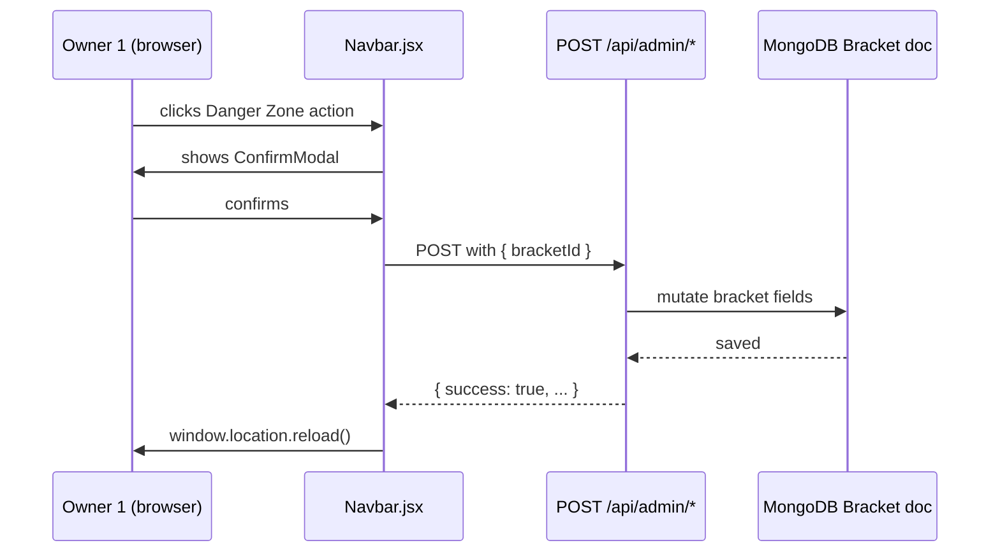

# Admin Panel — System Interactions

## Danger Zone actions and their API routes

| Button | Visible when | API endpoint | Fields mutated |
|--------|-------------|--------------|----------------|
| Unlock Names | `status !== 'draft'` | `POST /api/admin/unlock-names` | clears votes + matchups, status → draft, lock-in flags → false |
| Unlock Lock-In | `owner1LockedIn \|\| owner2LockedIn` | `POST /api/admin/unlock-lockin` | lock-in flags → false, matchup stubs cleared, status → draft |
| Remove Owner 2 | always | `DELETE /bracket/:id/owner2` | removes owner2 association |
| Delete Bracket | always | `DELETE /bracket/:id` | removes bracket document |
