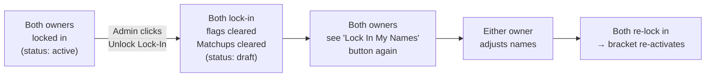

# Unlock Lock-In

After both parents submit and lock in their name lists, the bracket transitions to active and matchup stubs are generated. If either parent needs to adjust their names after locking in (but before voting begins), the admin (Owner 1) can use "Unlock Lock-In" to reset both lock-in states.

Unlocking resets the bracket back to draft, clears the generated matchup stubs, and opens the names page for editing again — without touching any names or any votes already cast.

The button is also visible when only one owner has locked in, so the admin can revert a partial lock-in without waiting for the second owner.
